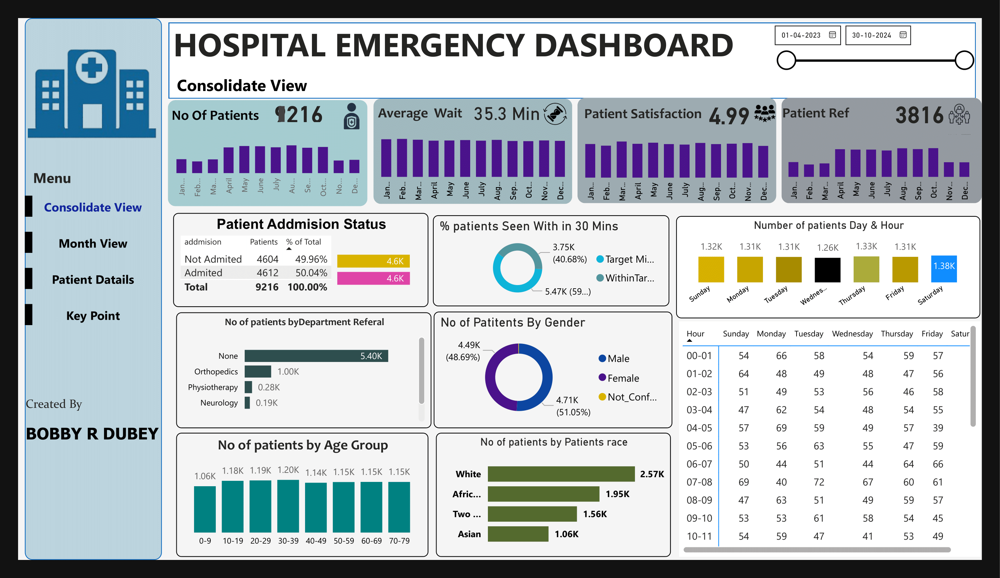
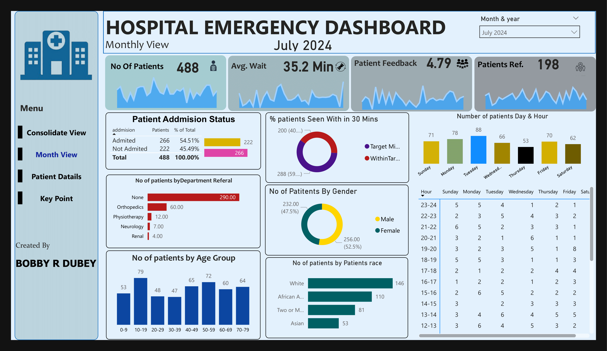
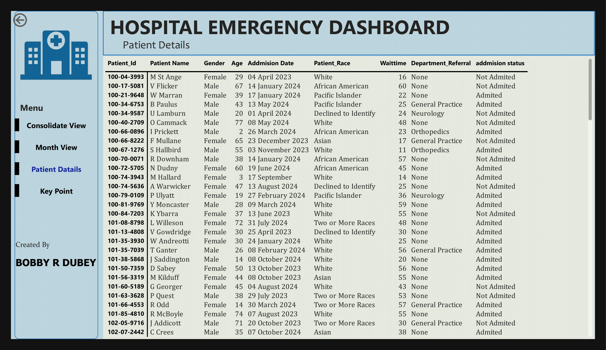
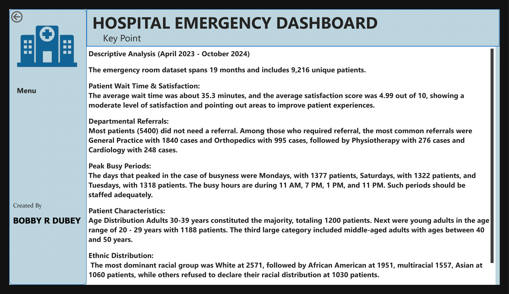

# 🏥 Hospital Emergency Room Dashboard

A comprehensive **Power BI** project analyzing emergency room (ER) operations — providing clear, actionable insights into patient visits, wait times, satisfaction, and departmental trends.

---

## 📌 Project Overview

This analysis answers critical healthcare questions such as:
- How many patients visit the ER daily and monthly?
- What is the average wait time and patient satisfaction score?
- What are the busiest hours and days?
- Which departments have the highest referrals?
- How do age, gender, and race affect patient distribution?

---

## 🧰 Tools Used

- **Power BI** — Data Modeling, Visualizations & Dashboards
- **SQL** — Data Extraction & Transformation
- **Microsoft Excel** — Data Cleaning & Preparation

---

## 🖥️ Dashboard Preview

### 📊 Monthly View


### 📋 Patient Details


### 📌 Key Points Summary


### 📈 Consolidate View


---

## 📊 Key Insights

- **Timeframe:** April 2023 – October 2024, covering **9,216 unique patients**.
- **Average Wait Time:** 35.3 minutes.
- **Patient Satisfaction:** Average score of **4.99/10**, highlighting improvement areas.
- **Department Referrals:** Majority did not need referral. Common referrals: General Practice, Orthopedics, Physiotherapy.
- **Peak Periods:** Mondays, Tuesdays & Saturdays; busy hours at 11 AM, 1 PM, 7 PM, and 11 PM.
- **Demographics:** Largest age group: 30–39 years. Dominant racial group: White, followed by African American and multiracial patients.

---

## 📁 Project Structure

```
📂 Hospital-Emergency-Dashboard/
├── 📊 Screenshots/
│   ├── HOSPITAL ER DATA-1.png
│   ├── HOSPITAL ER DATA-2.png
│   ├── HOSPITAL ER DATA-3.png
│   ├── HOSPITAL ER DATA-4.png
├── 📘 README.md
├── 📂 Data/ (optional raw & cleaned files)
├── 📂 Reports/
│   ├── Hospital-Emergency-Dashboard.pbix
```

---

## 🧹 Data Cleaning

- Removed duplicate records and null values.
- Standardized dates and timestamps for accuracy.
- Joined multiple source tables using SQL.
- Validated key metrics and cleaned in **Excel**.

---

## 📬 Contact

**Bobby Rameshchandra Dubey**  
[LinkedIn](https://www.linkedin.com/in/bobbydubey) • [GitHub](https://github.com/Bobby95453)

---

⭐ If you found this project useful, please ⭐ star the repo to show support!
